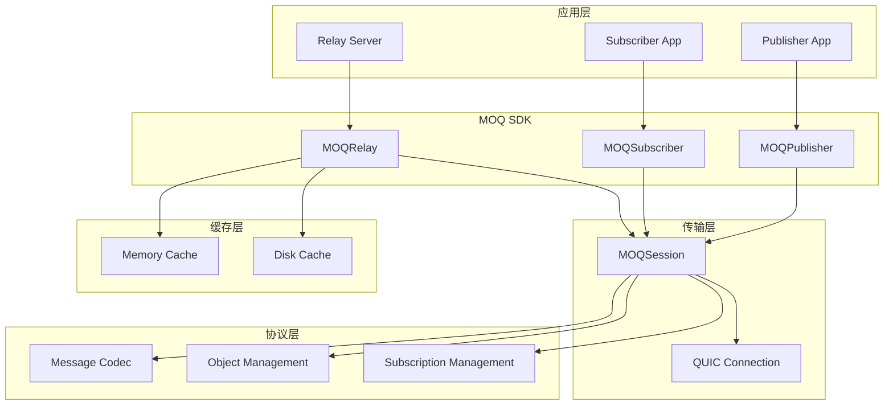
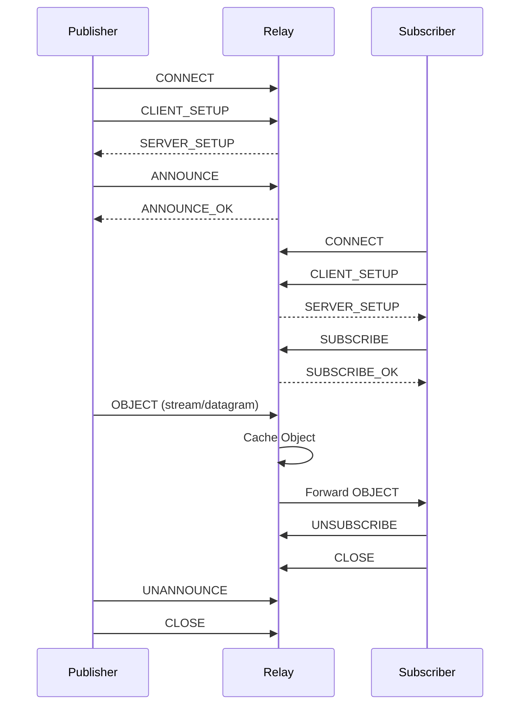
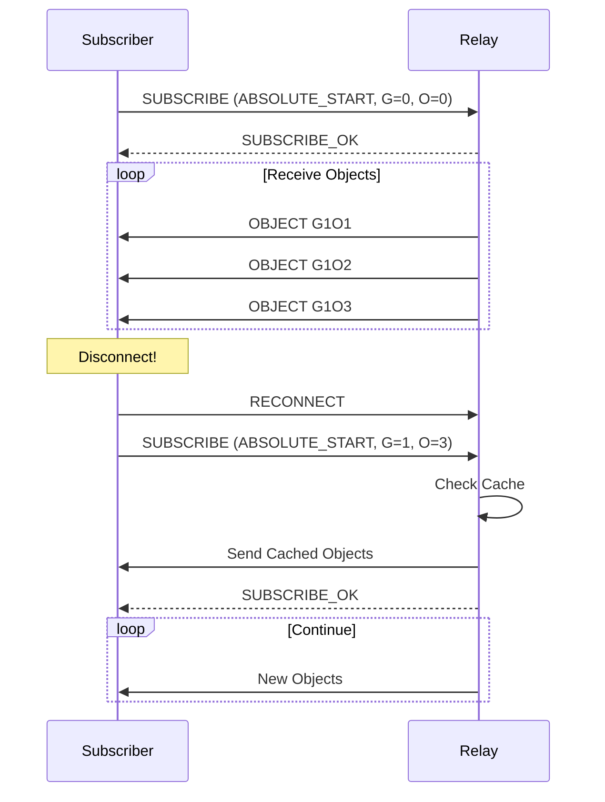

# MOQ Protocol 架构设计文档

## 1. 系统架构



## 2. 核心组件

### 2.1 Publisher (发布者)

- **职责**: 发布媒体流到 Relay
- **关键功能**:
  - 声明命名空间 (Announce)
  - 发布媒体对象
  - 管理轨道别名

### 2.2 Subscriber (订阅者)

- **职责**: 从 Relay 订阅并接收媒体流
- **关键功能**:
  - 订阅轨道 (Subscribe)
  - 接收对象回调
  - 断线重连恢复

### 2.3 Relay (中继服务器)

- **职责**: 路由媒体流，提供缓存服务
- **关键功能**:
  - 管理 Publisher 连接
  - 管理 Subscriber 订阅
  - 转发对象
  - 缓存管理

## 3. 消息流程

### 3.1 发布订阅流程



### 3.2 断线重连恢复流程



## 4. 缓存策略

### 4.1 双层缓存架构

```
┌─────────────────────────────────────────┐
│              Memory Cache               │
│  - LRU 淘汰策略                          │
│  - 高速访问                              │
│  - 容量限制 (默认 100MB)                 │
└──────────────────┬──────────────────────┘
                   │ Miss
                   ▼
┌─────────────────────────────────────────┐
│               Disk Cache                │
│  - SQLite 元数据管理                     │
│  - 文件存储                              │
│  - 容量限制 (默认 1GB)                   │
└─────────────────────────────────────────┘
```

### 4.2 缓存流程

1. Publisher 发送对象到 Relay
2. Relay 缓存对象到磁盘 (持久化)
3. 热点对象自动提升到内存缓存
4. Subscriber 重连时从缓存恢复数据

## 5. 接口设计

### 5.1 Publisher API

```python
class MOQPublisher:
    async def connect(host: str, port: int) -> None
    async def announce_namespace(*namespace: str) -> bool
    async def unannounce_namespace(*namespace: str) -> bool
    async def publish_object(track: MOQTrack, group_id: int, object_id: int, data: bytes) -> bool
    async def close() -> None
```

### 5.2 Subscriber API

```python
class MOQSubscriber:
    async def connect(host: str, port: int) -> None
    async def subscribe(*namespace: str, track_name: str, filter_type: int, ...) -> MOQSubscription
    async def unsubscribe(subscription: MOQSubscription) -> bool
    async def receive_objects(subscription: MOQSubscription) -> AsyncIterator[MOQObject]
    async def close() -> None
```

### 5.3 Relay API

```python
class MOQRelay:
    async def start(host: str = "0.0.0.0", port: int = 4433) -> None
    async def stop() -> None
    async def get_stats() -> dict
```

## 6. 扩展性设计

- **模块化架构**: 协议层、传输层、缓存层分离
- **插件机制**: 支持自定义消息处理器
- **配置驱动**: 通过配置调整缓存大小、优先级等
- **异步设计**: 基于 asyncio 的高并发处理
