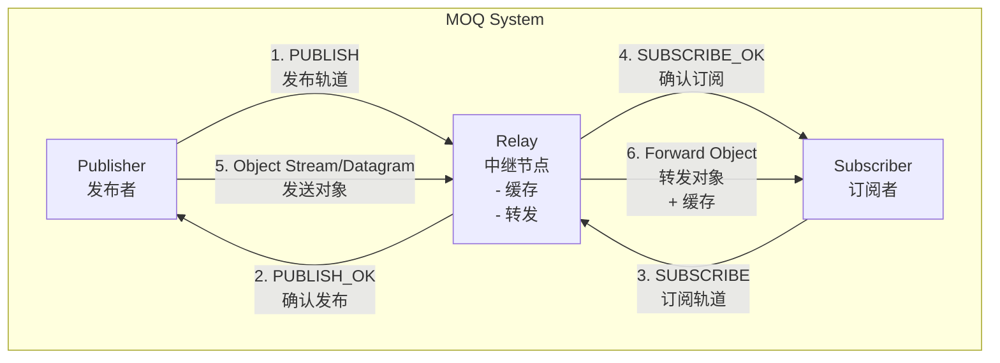
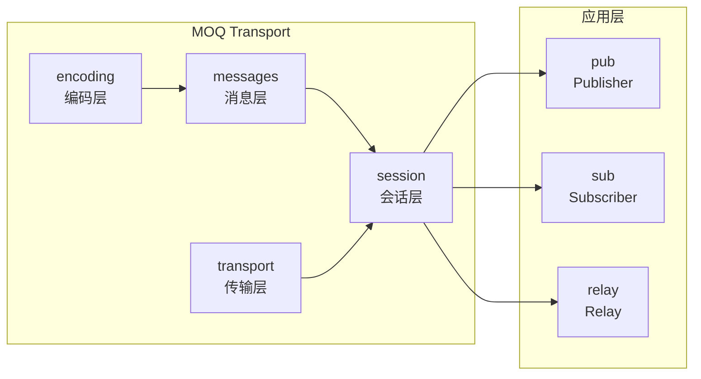

# MOQ Transport - Python Implementation

## 项目背景

本项目使用Python语言实现 [draft-ietf-moq-transport-17](https://datatracker.ietf.org/doc/draft-ietf-moq-transport/) 中定义的 **MOQ Transport (MOQT)** 协议。

MOQT 是一个基于 QUIC 的媒体传输协议，设计用于大规模、低延迟的媒体分发。它支持发布/订阅模式，允许生产者发布数据，多个端点通过订阅来消费数据。

### 核心特性

- **基于 QUIC**: 利用 QUIC 的流多路复用和连接迁移特性
- **发布/订阅模式**: 灵活的内容分发架构
- **Relay 支持**: 内置支持中继节点，支持缓存和转发
- **连接迁移**: 支持断网重连后的数据续传
- **多级缓存**: 支持内存和磁盘缓存，防止内存溢出

## 项目结构

```
moq-py/
├── moq/                      # 主代码目录
│   ├── __init__.py          # 包入口
│   ├── encoding/            # 编码模块
│   │   ├── __init__.py
│   │   ├── varint.py       # 变长整数编码
│   │   ├── kv.py           # 键值对编码
│   │   └── location.py     # 位置和轨道命名
│   ├── messages/            # 消息模块
│   │   ├── __init__.py
│   │   ├── control.py      # 控制消息 (SETUP, SUBSCRIBE, etc.)
│   │   └── data.py         # 数据消息 (Object, Datagram, etc.)
│   ├── transport/           # 传输层
│   │   ├── __init__.py
│   │   └── quic_transport.py  # QUIC 传输实现
│   ├── session/             # 会话管理
│   │   ├── __init__.py
│   │   └── session.py      # MOQ 会话管理
│   ├── relay/               # 中继节点
│   │   ├── __init__.py
│   │   └── relay.py        # Relay 实现与缓存
│   ├── pub/                 # 发布者
│   │   ├── __init__.py
│   │   └── publisher.py    # Publisher 实现
│   └── sub/                 # 订阅者
│       ├── __init__.py
│       └── subscriber.py   # Subscriber 实现
├── examples/                # 示例代码
│   ├── basic_example.py    # 基础发布订阅示例
│   └── reconnection_example.py  # 断线重连示例
├── tests/                   # 测试代码
├── docs/                    # 文档
├── requirements.txt         # 依赖项
└── README.md               # 本文件
```

## 系统架构

### 整体架构图



### 数据流时序图

```mermaid
sequenceDiagram
    participant P as Publisher
    participant R as Relay
    participant S as Subscriber
    participant C as Cache
    
    Note over P,R: 会话建立
    P->>R: SETUP (role=publisher)
    R->>P: SETUP (role=relay)
    
    Note over S,R: 会话建立
    S->>R: SETUP (role=subscriber)
    R->>S: SETUP (role=relay)
    
    Note over P,R: 发布流程
    P->>R: PUBLISH (track_name)
    R->>P: PUBLISH_OK
    
    Note over S,R: 订阅流程
    S->>R: SUBSCRIBE (track_name, filter)
    R->>S: SUBSCRIBE_OK
    
    Note over P,R,S: 数据传输
    loop 持续发送
        P->>R: Object (group, object, payload)
        R->>C: 缓存对象
        R->>S: Forward Object
    end
    
    Note over S,R: 断线重连
    S--xR: Connection Lost
    Note right of S: 等待...
    S->>R: Reconnect + SUBSCRIBE (from last position)
    R->>C: 查询缓存
    C->>R: 返回缓存对象
    R->>S: SUBSCRIBE_OK + 缓存数据
```

### 模块关系图



## 技术栈

- **语言**: Python 3.8+
- **QUIC 框架**: aioquic (支持连接迁移、双向流、数据报)
- **依赖**:
  - aioquic >= 0.9.0
  - cryptography >= 3.0
  - pylsqpack >= 0.3.0
  - pyopenssl >= 20.0
  - service-identity >= 18.0

## 快速开始

### 1. 环境准备

#### 安装依赖

```bash
# 创建虚拟环境（推荐）
python -m venv venv

# 激活虚拟环境
# Linux/Mac:
source venv/bin/activate
# Windows:
venv\Scripts\activate

# 安装依赖
pip install -r requirements.txt
```

#### 系统要求

- **Linux**: Ubuntu 18.04+, CentOS 7+, 或其他支持 Python 3.8+ 的发行版
- **Windows**: Windows 10/11, Python 3.8+
- **macOS**: macOS 10.14+, Python 3.8+

### 2. 运行示例

#### 基础发布订阅示例

```bash
# 终端 1: 启动 Relay
cd /home/acn/cxr/moq-py
python examples/basic_example.py relay

# 终端 2: 启动 Publisher
python examples/basic_example.py publisher

# 终端 3: 启动 Subscriber
python examples/basic_example.py subscriber
```

或者运行单进程演示：

```bash
python examples/basic_example.py demo
```

#### 断线重连示例

```bash
# 终端 1: 启动 Relay
python examples/reconnection_example.py relay

# 终端 2: 启动 Publisher
python examples/reconnection_example.py publisher

# 终端 3: 启动 Subscriber（会自动模拟断线重连）
python examples/reconnection_example.py subscriber
```

### 3. PyCharm 开发环境配置

1. **打开项目**: File -> Open -> 选择 `/home/acn/cxr/moq-py`

2. **配置 Python 解释器**:
   - File -> Settings -> Project -> Python Interpreter
   - 选择虚拟环境中的 Python 解释器

3. **安装依赖**: PyCharm 会自动检测 requirements.txt 并提示安装

4. **运行配置**:
   - Run -> Edit Configurations
   - 添加 Python 配置
   - Script path: 选择示例文件
   - Parameters: 运行模式 (relay/publisher/subscriber/demo)

## API 接口文档

### 编码模块 (moq.encoding)

#### VarInt - 变长整数

```python
from moq.encoding import VarInt

# 编码整数
encoded = VarInt.encode(12345)  # 返回 bytes

# 解码整数
value, consumed = VarInt.decode(encoded)  # 返回 (值, 消耗字节数)
```

#### FullTrackName - 完整轨道名称

```python
from moq.encoding import FullTrackName

# 创建轨道名称
namespace = [b"example", b"namespace"]
track_name = b"video"
full_name = FullTrackName(namespace, track_name)

# 编码/解码
encoded = full_name.encode()
decoded, consumed = FullTrackName.decode(encoded)
```

### Publisher API

```python
from moq.pub import MOQPublisher, PublishedObject
from moq.encoding import FullTrackName

# 创建 Publisher
publisher = MOQPublisher("relay.example.com", 4433)

# 设置回调
def on_connected():
    print("Connected to relay")

def on_publication_accepted(track_name):
    print(f"Publication accepted: {track_name}")

publisher.set_handlers(
    on_connected=on_connected,
    on_publication_accepted=on_publication_accepted
)

# 连接
await publisher.connect()

# 发布轨道
track_name = FullTrackName([b"my", b"namespace"], b"mytrack")
await publisher.publish(track_name)

# 发送对象
obj = PublishedObject(
    group_id=1,
    object_id=1,
    payload=b"Hello, World!",
    publisher_priority=128,
    use_datagram=False  # 或使用 True 发送数据报
)
await publisher.send_object(track_name, obj)

# 停止发布
await publisher.unpublish(track_name, reason="Finished")
publisher.disconnect()
```

### Subscriber API

```python
from moq.sub import MOQSubscriber, ReceivedObject
from moq.encoding import FullTrackName

# 创建 Subscriber
subscriber = MOQSubscriber("relay.example.com", 4433)

# 设置回调
def on_object_received(obj: ReceivedObject):
    print(f"Received: group={obj.group_id}, object={obj.object_id}")
    print(f"Payload: {obj.payload}")

def on_subscription_accepted(track_name):
    print(f"Subscription accepted: {track_name}")

subscriber.set_handlers(
    on_object_received=on_object_received,
    on_subscription_accepted=on_subscription_accepted
)

# 连接
await subscriber.connect()

# 订阅轨道
track_name = FullTrackName([b"my", b"namespace"], b"mytrack")
await subscriber.subscribe(
    track_name,
    subscriber_priority=128,
    start_group=None,  # None = 从最新开始
    start_object=None
)

# 获取特定范围对象 (Fetch)
request_id = await subscriber.fetch(
    track_name,
    start_group=1,
    start_object=1,
    end_group=5,
    end_object=100
)

# 取消订阅
await subscriber.unsubscribe(track_name)
subscriber.disconnect()
```

### Relay API

```python
from moq.relay import MOQRelay

# 创建 Relay
relay = MOQRelay(
    host="0.0.0.0",
    port=4433,
    cache_dir="/var/cache/moq",
    max_memory_cache=100 * 1024 * 1024,  # 100MB
    max_disk_cache=1024 * 1024 * 1024     # 1GB
)

# 启动
await relay.start()

# 注册会话
relay.register_session(session)

# 获取缓存统计
stats = relay.get_cache_stats()
print(f"Cache hit rate: {stats['hit_rate']:.2%}")

# 停止
await relay.stop()
```

## 消息类型说明

### 控制消息

| 消息类型 | 值 | 描述 |
|---------|-----|------|
| SETUP | 0x01 | 会话建立 |
| GOAWAY | 0x10 | 会话终止 |
| REQUEST_OK | 0x02 | 请求成功响应 |
| REQUEST_ERROR | 0x03 | 请求错误响应 |
| SUBSCRIBE | 0x04 | 订阅请求 |
| SUBSCRIBE_OK | 0x05 | 订阅成功响应 |
| PUBLISH | 0x07 | 发布请求 |
| PUBLISH_OK | 0x08 | 发布成功响应 |
| PUBLISH_DONE | 0x09 | 发布结束 |
| FETCH | 0x0A | 获取特定对象请求 |
| FETCH_OK | 0x0B | 获取成功响应 |

### 数据消息

| 消息类型 | 描述 |
|---------|------|
| Object Datagram | 通过数据报发送的对象 |
| Subgroup Stream | 子组流中的对象序列 |
| Fetch Stream | 获取响应流 |

## 日志配置

```python
import logging

# 配置日志
logging.basicConfig(
    level=logging.DEBUG,  # DEBUG, INFO, WARNING, ERROR
    format='%(asctime)s - %(name)s - %(levelname)s - %(message)s'
)

# 模块特定日志级别
logging.getLogger('moq.session').setLevel(logging.INFO)
logging.getLogger('moq.relay').setLevel(logging.DEBUG)
```

## 性能优化

### 缓存调优

```python
# 根据可用内存调整缓存大小
relay = MOQRelay(
    cache_dir="/fast/ssd/cache",
    max_memory_cache=512 * 1024 * 1024,  # 512MB 内存缓存
    max_disk_cache=10 * 1024 * 1024 * 1024  # 10GB 磁盘缓存
)
```

### 优先级设置

```python
# 高优先级对象 (0-255, 越小优先级越高)
obj = PublishedObject(
    group_id=1,
    object_id=1,
    payload=data,
    publisher_priority=10  # 高优先级
)
```

## 故障排除

### 常见问题

1. **连接失败**
   - 检查 Relay 是否正在运行
   - 检查防火墙设置
   - 确认端口未被占用

2. **依赖安装失败**
   - 确保 Python >= 3.8
   - 安装编译工具: `apt-get install build-essential python3-dev` (Linux)

3. **内存不足**
   - 减小 `max_memory_cache`
   - 启用磁盘缓存
   - 增加 `max_disk_cache`

### 调试模式

```bash
# 启用详细日志
MOQ_LOG_LEVEL=DEBUG python example.py
```

## 开发计划

- [x] 基础消息编解码
- [x] QUIC 传输层
- [x] 会话管理
- [x] Publisher/Subscriber 实现
- [x] Relay 与缓存
- [x] 基础示例
- [ ] WebTransport 支持
- [ ] 更完整的错误处理
- [ ] 性能测试与优化
- [ ] TLS 证书管理

## 贡献

欢迎提交 Issue 和 Pull Request。

## 许可证

MIT License - 详见 LICENSE 文件

## 参考文档

- [draft-ietf-moq-transport-17](https://datatracker.ietf.org/doc/draft-ietf-moq-transport/)
- [QUIC RFC 9000](https://datatracker.ietf.org/doc/html/rfc9000)
- [WebTransport](https://www.w3.org/TR/webtransport/)
