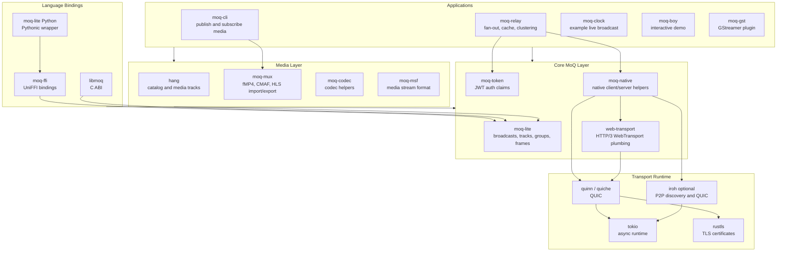
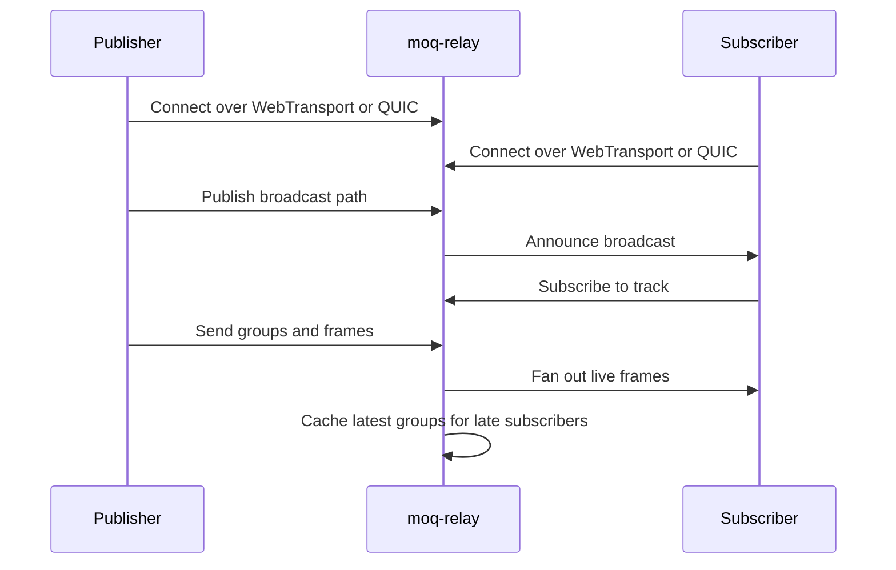
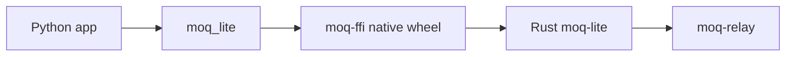

# Architecture

MoQ is split into small protocol, media, runtime, and application layers. The Rust implementation provides the relay, command-line tools, media adapters, native transport integration, and FFI bindings used by Python and other languages.

## Data Flow

## Package Map

| Area | Rust crates and packages | Role |
| --- | --- | --- |
| Core protocol | `rs/moq-lite` | Broadcast, track, group, frame, subscribe, publish, fetch, and announce primitives. |
| Native transport | `rs/moq-native`, `rs/web-transport` | Native QUIC/WebTransport client and server setup. |
| Relay | `rs/moq-relay` | Server that routes publications to subscribers, caches groups, and supports clustering. |
| Media | `rs/hang`, `rs/moq-mux`, `rs/moq-msf`, `rs/moq-codec` | Catalogs, encoded media tracks, muxing, demuxing, and codec-specific helpers. |
| Auth | `rs/moq-token`, `rs/moq-token-cli` | JWT signing, verification, and path-based publish/subscribe authorization. |
| Tooling | `rs/moq-cli`, `rs/moq-clock`, `rs/moq-boy`, `rs/moq-gst` | Command-line tools, demos, and GStreamer integration. |
| Bindings | `rs/libmoq`, `rs/moq-ffi`, `py/moq-lite` | C ABI, UniFFI bindings, and Python wrapper around the Rust implementation. |

## Python Integration

Python applications should normally import `moq_lite`. That package wraps `moq-ffi`, which is generated from the Rust `rs/moq-ffi` crate and uses the same Rust protocol stack as the relay.

