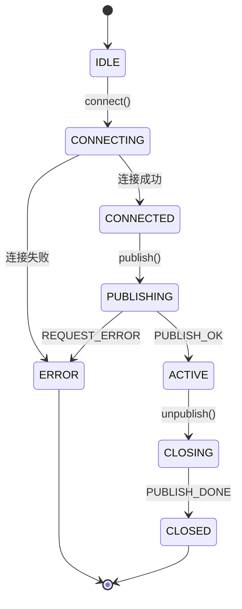
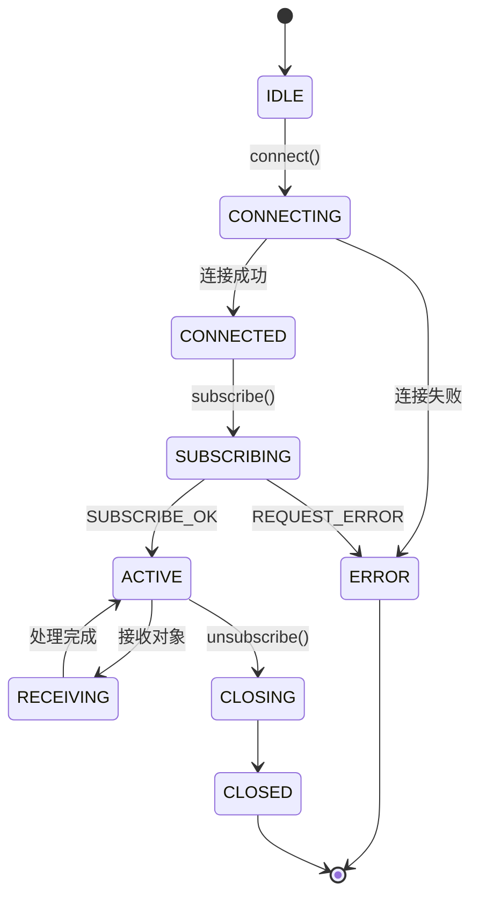
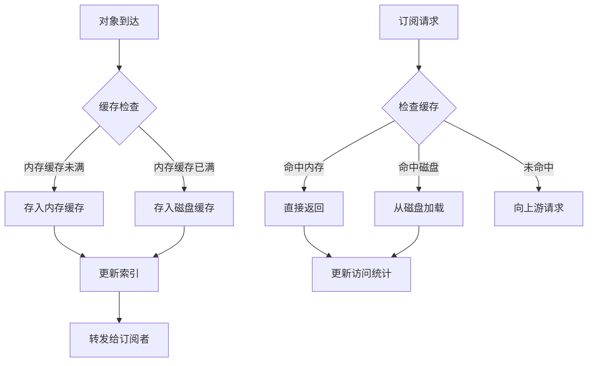
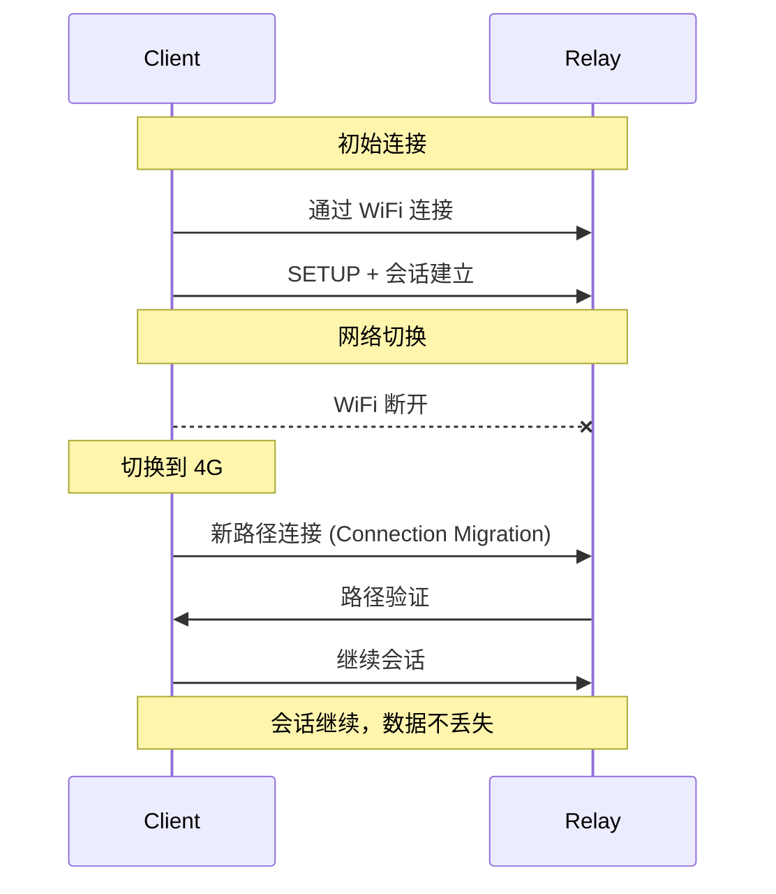
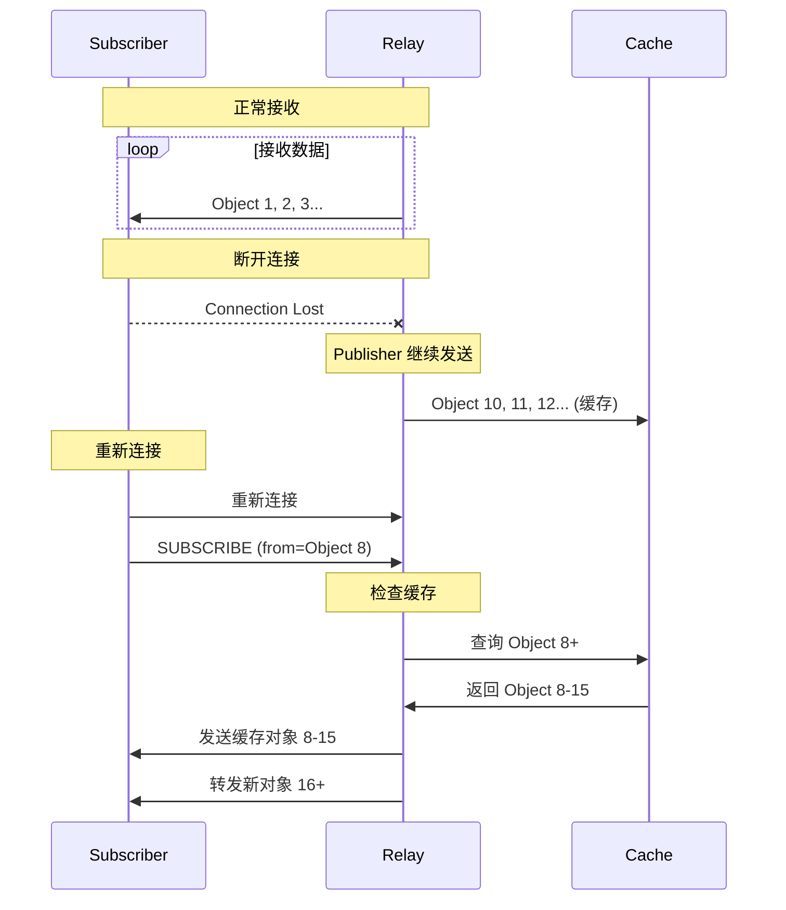
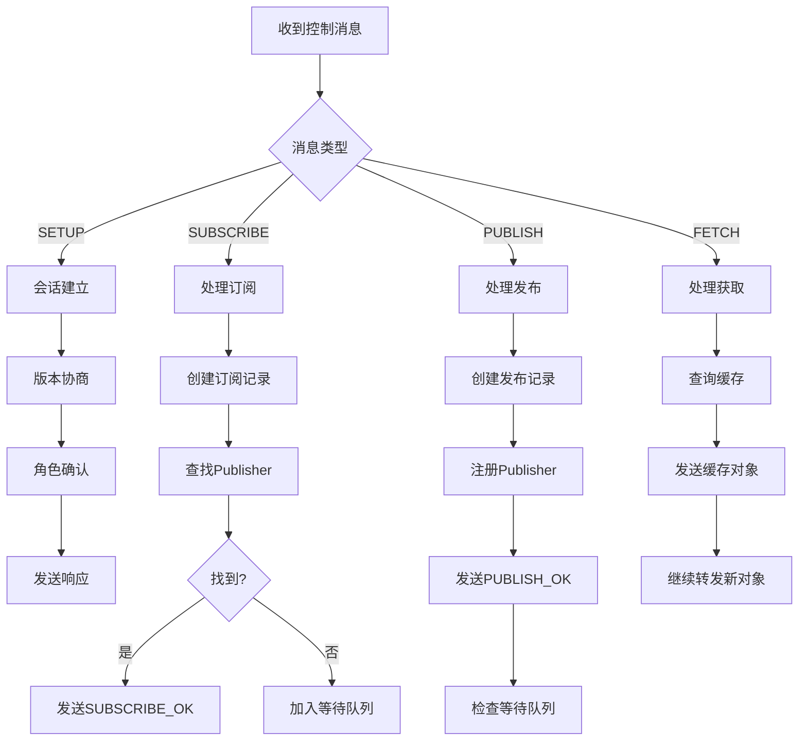
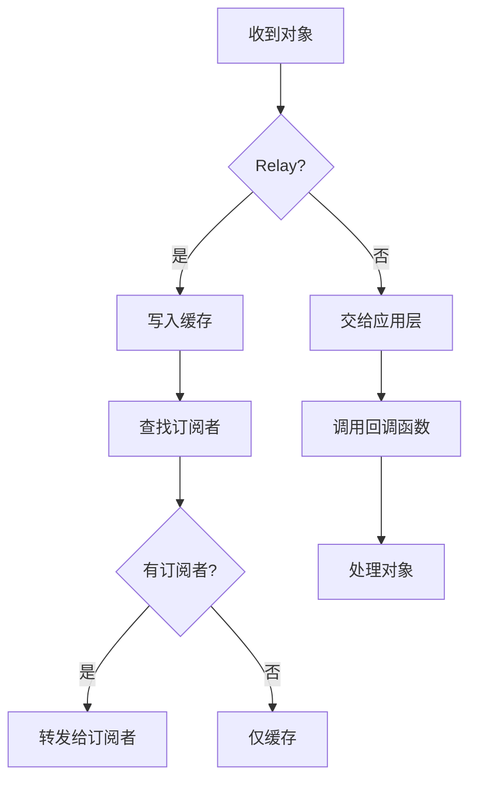

# MOQ Transport - 系统架构设计文档

## 1. 概述

### 1.1 项目目标

本项目实现 draft-ietf-moq-transport-17 协议，提供完整的 MOQ Transport (MOQT) 协议支持，包括：

- 会话建立和管理
- 发布/订阅机制
- 数据传输（流和数据报）
- 中继节点（Relay）与缓存
- 连接迁移和断线重连

### 1.2 设计原则

1. **模块化设计**: 各组件职责清晰，易于扩展
2. **异步IO**: 基于 asyncio 实现高性能并发
3. **类型安全**: 使用类型注解，便于静态检查和IDE支持
4. **日志完善**: 关键操作都有详细的日志记录
5. **跨平台**: 支持 Linux 和 Windows

## 2. 系统架构

### 2.1 分层架构

```
┌─────────────────────────────────────────────────────────────┐
│                     应用层 (Application)                     │
│  ┌─────────────┐  ┌─────────────┐  ┌─────────────────────┐ │
│  │  Publisher  │  │  Subscriber │  │       Relay         │ │
│  └─────────────┘  └─────────────┘  └─────────────────────┘ │
└─────────────────────────────────────────────────────────────┘
                              │
┌─────────────────────────────────────────────────────────────┐
│                     会话层 (Session)                         │
│  ┌─────────────────────────────────────────────────────┐   │
│  │              MOQSession                              │   │
│  │  - 订阅管理 (Subscriptions)                          │   │
│  │  - 发布管理 (Publications)                           │   │
│  │  - 请求ID管理 (Request ID)                           │   │
│  └─────────────────────────────────────────────────────┘   │
└─────────────────────────────────────────────────────────────┘
                              │
┌─────────────────────────────────────────────────────────────┐
│                     传输层 (Transport)                       │
│  ┌─────────────────────────────────────────────────────┐   │
│  │            QUIC Transport (aioquic)                  │   │
│  │  - 双向流 (Bidirectional Streams)                    │   │
│  │  - 单向流 (Unidirectional Streams)                   │   │
│  │  - 数据报 (Datagrams)                                │   │
│  │  - 连接迁移 (Connection Migration)                   │   │
│  └─────────────────────────────────────────────────────┘   │
└─────────────────────────────────────────────────────────────┘
                              │
┌─────────────────────────────────────────────────────────────┐
│                     消息层 (Messages)                        │
│  ┌─────────────────────┐  ┌─────────────────────────────┐   │
│  │   控制消息          │  │      数据消息               │   │
│  │  - SETUP            │  │  - Object Datagram          │   │
│  │  - SUBSCRIBE        │  │  - Subgroup Stream          │   │
│  │  - PUBLISH          │  │  - Fetch Stream             │   │
│  │  - FETCH            │  │                             │   │
│  └─────────────────────┘  └─────────────────────────────┘   │
└─────────────────────────────────────────────────────────────┘
                              │
┌─────────────────────────────────────────────────────────────┐
│                     编码层 (Encoding)                        │
│  ┌─────────────┐  ┌─────────────┐  ┌─────────────────────┐   │
│  │  VarInt     │  │KeyValuePair │  │ Location / Track    │   │
│  └─────────────┘  └─────────────┘  └─────────────────────┘   │
└─────────────────────────────────────────────────────────────┘
```

### 2.2 核心组件

#### 2.2.1 Publisher（发布者）

**职责**: 发布媒体轨道（Track），发送对象（Object）

**核心功能**:
- 连接到 Relay
- 发布轨道（PUBLISH）
- 发送对象（Stream 或 Datagram）
- 管理子组流（Subgroup Streams）

**状态机**:


#### 2.2.2 Subscriber（订阅者）

**职责**: 订阅轨道，接收对象

**核心功能**:
- 连接到 Relay
- 订阅轨道（SUBSCRIBE）
- 接收对象（回调处理）
- 支持范围获取（FETCH）

**状态机**:


#### 2.2.3 Relay（中继节点）

**职责**: 转发数据，缓存内容，支持断线续传

**核心功能**:
- 管理 Publisher 和 Subscriber 连接
- 转发对象（订阅匹配）
- 多级缓存（内存 + 磁盘）
- 支持连接迁移后的数据恢复

**缓存策略**:


**缓存层级**:
1. **L1 - 内存缓存**: 最近使用对象，快速访问
2. **L2 - 磁盘缓存**: 持久化存储，支持大容量
3. **索引**: 快速定位缓存对象

### 2.3 数据流

#### 2.3.1 发布订阅流程

```mermaid
sequenceDiagram
    participant P as Publisher
    participant R as Relay
    participant S as Subscriber
    participant C as Cache

    Note over P,R: 阶段1: 会话建立
    P->>R: QUIC 连接
    P->>R: SETUP (role=publisher)
    R->>P: SETUP (role=relay)

    Note over S,R: 阶段2: 会话建立
    S->>R: QUIC 连接
    S->>R: SETUP (role=subscriber)
    R->>S: SETUP (role=relay)

    Note over P,R: 阶段3: 发布注册
    P->>R: PUBLISH (track_name)
    R->>P: PUBLISH_OK
    R->>R: 注册Publisher

    Note over S,R: 阶段4: 订阅注册
    S->>R: SUBSCRIBE (track_name, filter)
    R->>S: SUBSCRIBE_OK
    R->>R: 注册Subscriber
    R->>R: 匹配Publisher

    Note over P,R,S: 阶段5: 数据传输
    loop 持续发送
        P->>R: Object (group, object, payload)
        R->>C: 异步缓存
        R->>S: 转发对象
    end

    Note over S,R: 阶段6: 断开重连
    S--xR: 连接断开
    Note right of S: 网络中断...
    S->>R: 重新连接
    S->>R: SUBSCRIBE (track_name, from=last_pos)
    R->>C: 查询缓存
    C->>R: 返回缓存对象
    R->>S: SUBSCRIBE_OK + 缓存数据
    R->>S: 继续转发新对象
```

#### 2.3.2 对象发送流程

**通过流发送（可靠传输）**:
```python
# 1. 打开单向流
stream_id = await client.open_stream(unidirectional=True)

# 2. 发送子组头
header = SubgroupHeader(
    track_alias=track_alias,
    group_id=group_id,
    subgroup_id=subgroup_id,
    publisher_priority=priority
)
await client.send_stream_data(stream_id, header.encode())

# 3. 发送对象
for object_id, payload in objects:
    obj = SubgroupObject(
        object_id=object_id,
        payload=payload
    )
    await client.send_stream_data(stream_id, obj.encode())

# 4. 关闭流
await client.send_stream_data(stream_id, b'', end_stream=True)
```

**通过数据报发送（低延迟）**:
```python
# 直接发送，无连接开销
header = ObjectHeader(
    track_alias=track_alias,
    group_id=group_id,
    object_id=object_id,
    publisher_priority=priority
)
datagram = ObjectDatagram(header=header, payload=payload)
await client.send_datagram(datagram.encode())
```

### 2.4 连接管理

#### 2.4.1 连接迁移

MOQT 支持 QUIC 的连接迁移特性，允许在 IP 地址或网络接口变化时保持连接：



#### 2.4.2 断线重连与缓存恢复

当连接完全断开时，通过 Relay 缓存恢复数据：



## 3. 缓存设计

### 3.1 缓存架构

```
┌────────────────────────────────────────────────────────────┐
│                     ObjectCache                             │
├────────────────────────────────────────────────────────────┤
│  L1 Cache (内存)                                            │
│  ┌─────────────────────────────────────────────────────┐  │
│  │  FullTrackName → {Location → CachedObject}          │  │
│  │  - 快速访问                                          │  │
│  │  - LRU 淘汰策略                                       │  │
│  │  - 最大容量: 100MB (可配置)                            │  │
│  └─────────────────────────────────────────────────────┘  │
├────────────────────────────────────────────────────────────┤
│  L2 Cache (磁盘)                                            │
│  ┌─────────────────────────────────────────────────────┐  │
│  │  /cache_dir/                                        │  │
│  │  ├── cache_index.json  (索引)                        │  │
│  │  └── <track_id>/                                    │  │
│  │      └── <group_id>/                                │  │
│  │          └── <object_id>.obj                        │  │
│  │  - 持久化存储                                         │  │
│  │  - 最大容量: 1GB (可配置)                             │  │
│  └─────────────────────────────────────────────────────┘  │
└────────────────────────────────────────────────────────────┘
```

### 3.2 缓存策略

#### 3.2.1 写入策略

1. **写入内存**: 所有对象先写入内存缓存
2. **异步持久化**: 同时异步写入磁盘缓存
3. **内存淘汰**: 当内存满时，按 LRU 策略淘汰到磁盘

#### 3.2.2 读取策略

1. **L1 查询**: 先查内存缓存
2. **L2 查询**: 内存未命中时查磁盘
3. **升级**: 磁盘命中后升级回内存
4. **上游请求**: 都未命中时向上游请求

#### 3.2.3 淘汰策略

**内存淘汰（LRU）**:
```python
def _evict_memory_if_needed(self):
    if self._memory_size <= self.max_memory_size:
        return
    
    # 按访问时间排序
    sorted_objects = sorted(
        all_objects,
        key=lambda x: x[2].timestamp  # 访问时间
    )
    
    # 淘汰最旧的对象直到低于阈值
    while self._memory_size > threshold:
        evict_oldest_object()
```

**磁盘淘汰（Size-based）**:
- 当磁盘缓存满时，删除最旧的轨道组
- 定期清理过期对象

### 3.3 缓存统计

```python
{
    'memory_size': 50_000_000,      # 当前内存使用 (bytes)
    'memory_objects': 1000,          # 内存中对象数
    'disk_size': 200_000_000,       # 当前磁盘使用 (bytes)
    'hits': 5000,                    # 缓存命中次数
    'misses': 1000,                  # 缓存未命中次数
    'hit_rate': 0.833                # 命中率 (83.3%)
}
```

## 4. 消息流程

### 4.1 控制消息处理



### 4.2 数据消息处理



## 5. 接口设计

### 5.1 Publisher API

```python
class MOQPublisher:
    async def connect(self) -> bool
    def disconnect(self)
    
    async def publish(self, track_name: FullTrackName) -> bool
    async def unpublish(self, track_name: FullTrackName, reason: str)
    
    async def send_object(self, track_name: FullTrackName, obj: PublishedObject)
    async def close_subgroup_stream(self, track_alias: int, group_id: int, subgroup_id: int)
    
    # 事件处理器
    def set_handlers(
        on_connected: Optional[Callable] = None,
        on_disconnected: Optional[Callable] = None,
        on_publication_accepted: Optional[Callable[[FullTrackName], None]] = None,
        on_publication_rejected: Optional[Callable[[FullTrackName, str], None]] = None
    )
```

### 5.2 Subscriber API

```python
class MOQSubscriber:
    async def connect(self) -> bool
    def disconnect(self)
    
    async def subscribe(
        self, 
        track_name: FullTrackName,
        subscriber_priority: int = 128,
        start_group: Optional[int] = None,
        start_object: Optional[int] = None
    ) -> bool
    
    async def unsubscribe(self, track_name: FullTrackName)
    
    async def fetch(
        self,
        track_name: FullTrackName,
        start_group: int,
        start_object: int,
        end_group: int,
        end_object: int,
        subscriber_priority: int = 128
    ) -> int
    
    # 事件处理器
    def set_handlers(
        on_connected: Optional[Callable] = None,
        on_disconnected: Optional[Callable] = None,
        on_object_received: Optional[Callable[[ReceivedObject], None]] = None,
        on_subscription_accepted: Optional[Callable[[FullTrackName], None]] = None,
        on_subscription_rejected: Optional[Callable[[FullTrackName, str], None]] = None
    )
```

### 5.3 Relay API

```python
class MOQRelay:
    async def start(self)
    async def stop(self)
    
    def register_session(self, session: MOQSession)
    def unregister_session(self, session: MOQSession)
    
    def cache_object(self, track_name: FullTrackName, obj: CachedObject)
    async def serve_cached_objects(
        self, 
        session: MOQSession, 
        track_name: FullTrackName,
        start: Location, 
        end: Location
    )
    
    def get_cache_stats(self) -> dict
```

## 6. 性能优化

### 6.1 传输优化

1. **批量发送**: 累积多个对象后批量发送，减少系统调用
2. **流复用**: 同一子组的对象复用同一个流
3. **优先级调度**: 高优先级对象优先发送
4. **零拷贝**: 避免不必要的数据拷贝

### 6.2 缓存优化

1. **预读取**: 预测订阅者可能需要的数据并提前加载
2. **压缩**: 对磁盘缓存进行压缩，节省空间
3. **索引优化**: 使用哈希索引加速查询
4. **异步IO**: 磁盘操作使用异步IO避免阻塞

### 6.3 内存优化

1. **对象池**: 复用对象，减少GC压力
2. **内存映射**: 大对象使用内存映射文件
3. **流式处理**: 大对象流式处理，不全部加载到内存

## 7. 错误处理

### 7.1 错误分类

| 错误类型 | 描述 | 处理方式 |
|---------|------|---------|
| 连接错误 | QUIC连接失败 | 重连，指数退避 |
| 协议错误 | 消息格式错误 | 关闭会话 |
| 应用错误 | 订阅/发布失败 | 返回错误码 |
| 资源错误 | 内存/磁盘不足 | 清理缓存，降级服务 |

### 7.2 错误码

```python
class ErrorCode(IntEnum):
    INTERNAL_ERROR = 0x00
    UNAUTHORIZED = 0x01
    PROTOCOL_VIOLATION = 0x02
    DUPLICATE_TRACK_ALIAS = 0x03
    PARAMETER_LENGTH_MISMATCH = 0x04
    GOAWAY_TIMEOUT = 0x10
    KEY_VALUE_FORMATTING_ERROR = 0xF0
```

## 8. 安全考虑

### 8.1 传输安全

- 使用 QUIC 内置的 TLS 1.3
- 证书验证
- 前向保密

### 8.2 应用安全

- 授权令牌验证
- 速率限制
- 资源配额

### 8.3 缓存安全

- 敏感数据不缓存或加密缓存
- 缓存隔离
- 访问控制

## 9. 扩展性设计

### 9.1 水平扩展

- 多个 Relay 组成集群
- 负载均衡
- 状态同步

### 9.2 插件系统

```python
class MOQPlugin:
    def on_object_received(self, obj: Object) -> Object:
        # 处理对象，返回修改后的对象
        return obj
    
    def on_object_forward(self, obj: Object, subscribers: List[Session]):
        # 控制转发行为
        pass
```

## 10. 监控与运维

### 10.1 监控指标

- 连接数
- 消息吞吐量
- 缓存命中率
- 延迟分布
- 错误率

### 10.2 日志级别

- DEBUG: 详细消息流
- INFO: 关键状态变更
- WARNING: 可恢复错误
- ERROR: 需要干预的错误

## 11. 参考文档

- [draft-ietf-moq-transport-17](https://datatracker.ietf.org/doc/draft-ietf-moq-transport/)
- [QUIC RFC 9000](https://datatracker.ietf.org/doc/html/rfc9000)
- [RFC 9001 - QUIC TLS](https://datatracker.ietf.org/doc/html/rfc9001)
- [aioquic Documentation](https://aiortc.readthedocs.io/en/latest/api/aioquic.html)
